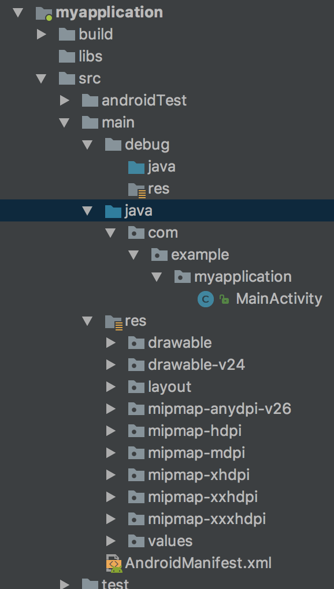

# ReModule
Gradle android 平台组件化gradle插件
作用：
    1.组件化开发过程中，作为组件的module，以往经常通过改变gradle.build中的一个变量来控制是否可以单独运行，
    而非自动化，这样造经常的要把这个变量更改有时候又错误的把他提交大版本控制中，造成不必要的问题。ReModule彻底解决了这个问题。
    2.规约debug文件夹中的文件不会最终打包到主工程中
    

## 使用方法
 以下配置gradle 版本在4.0以上
### 1.依赖引入
 在工程根目录的build.gradle中添加classpath
 
 build.gradle
 ```groovy
    buildscript {
        
        repositories {
            google()
            jcenter()
        }
        dependencies {
            classpath 'com.android.tools.build:gradle:3.0.1'
            classpath 'com.novoda:bintray-release:0.5.0'
            classpath 'com.zhangzhe.module:moduleHelper:0.0.2'//加入此行
        }
    }
    
    allprojects {
        repositories {
            google()
            jcenter()
           
        }
    }
    
    
    task clean(type: Delete) {
        delete rootProject.buildDir
    }

 ```
 
 主工程中不用动，项目模块中修改build.gradle
 
 ```groovy
 
     apply plugin: 'ReModule' //去掉libray 插件 使用ReModule
     
     android {
         compileSdkVersion 26
         defaultConfig {
             if (isRunAlone.toBoolean()){//这里这么配 ，后期优化
                 applicationId "com.example.myapplication"
             }
     
             minSdkVersion 14
             targetSdkVersion 26
             versionCode 1
             versionName "1.0"
     
             testInstrumentationRunner "android.support.test.runner.AndroidJUnitRunner"
     
         }
     
         buildTypes {
             release {
                 minifyEnabled false
                 proguardFiles getDefaultProguardFile('proguard-android.txt'), 'proguard-rules.pro'
             }
         }
     
     }
     
     dependencies {
         implementation fileTree(dir: 'libs', include: ['*.jar'])
     
         implementation 'com.android.support:appcompat-v7:26.1.0'
         implementation 'com.android.support.constraint:constraint-layout:1.0.2'
         testImplementation 'junit:junit:4.12'
         androidTestImplementation 'com.android.support.test:runner:1.0.1'
         androidTestImplementation 'com.android.support.test.espresso:espresso-core:3.0.1'
     }
     
     //maven 配置按自己需求
     apply plugin: 'maven'
     
     group = 'com.zhangzhe.myapplication'
     version = '0.0.1'
     
     uploadArchives {
         repositories {
             mavenDeployer {
                 repository(url: uri('../repo'))
             }
         }
     }
     
 ```
 
 ### 2.默认规约
 ReModule 插件规约
 在组件工程中项目结构如下
 
 
 
 在 src/main 目录下 除了debug 下的东西都会打到aar包中，而debug包中
 可以放单独运行时需要用到的类和资源
 
 ### 3.同步一下
   此时就可以每个module 可以单独跑起来，当他需要达成arr上传私有maven的时候，
   配置一下maven相关配置，即可上传，
   
   注：aar包中的manifest.xml 会取出application节点所有属性，及activity中带有
    启动的intentfilter 以便于合并到主工程的时候不会覆盖主工程application 而且不会产生多个app入口
